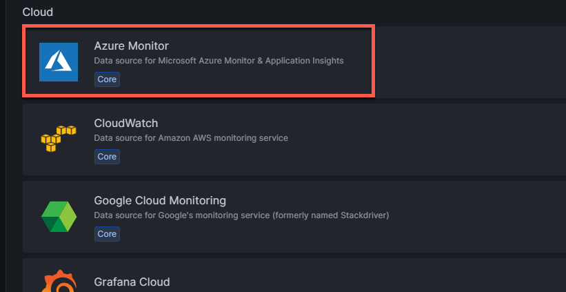
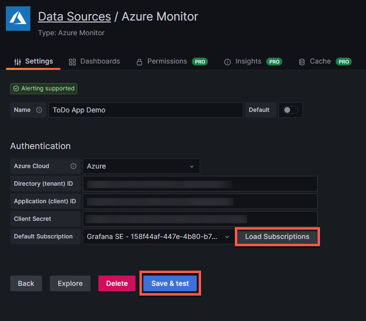
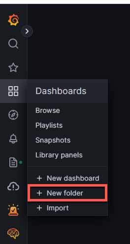
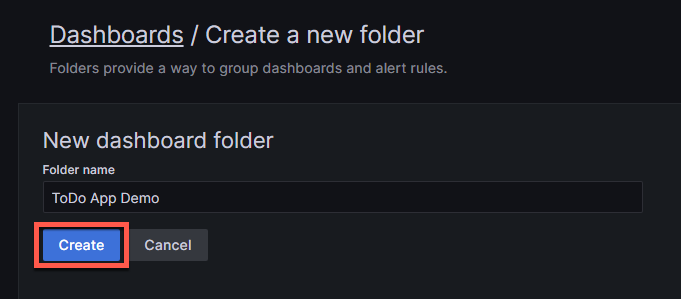
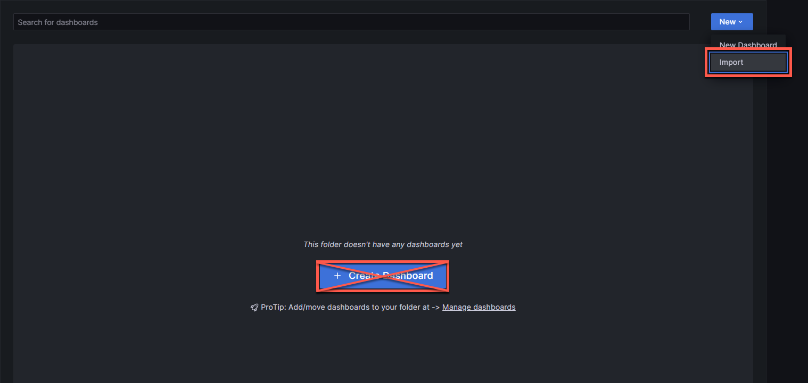
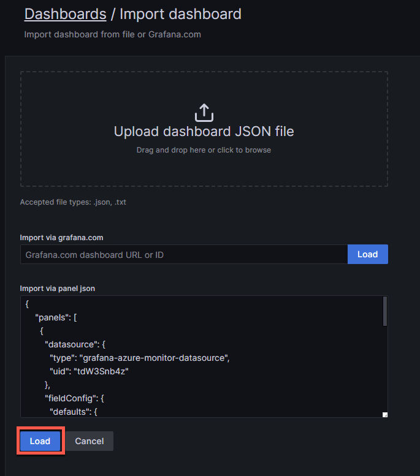
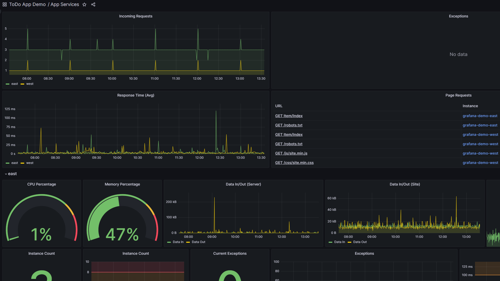

# Dashboards
<!-- markdownlint-disable-next-line MD036 -->
**Time Required: 45-60 minutes**

There are three dashboards included with this demo:

* App Services
* Cosmos DB
* Traffic Manager

The following instructions will walk you through "deploying" these dashboards. There are four steps to this section.

- [ ] [Step 1: Creating Permissions in Azure](#step-1-creating-permissions-in-azure)
- [ ] [Step 2: Adding Azure Monitor as a Data Source](#step-2-adding-azure-monitor-as-a-data-source)
- [ ] [Step 3: Preparing Your Dashboards](#step-3-preparing-your-dashboards)
- [ ] [Step 4: Building Your Dashboards](#step-4-building-your-dashboards)

## Prerequisites

1. You will need to deploy the infrastructure in this repo and have the resource names available (the JSON output from the deployment).
2. A Grafana account. You can create a [free](https://grafana.com/auth/sign-up/create-user) Grafana SaaS account or deploy an Azure Managed Grafana instance (outside the scope of this demo).

## Step 1: Creating Permissions in Azure

Grafana needs to access two things within your subscription&mdash;the resource providers and the monitoring telemetry. The latter access can be granted at the individual resource or resource group level, depending on what you want to monitor, while the former must have access at the subscription level. For the ease of this demo, we're going to grant access for both permissions at the subscription level.

### Reader Role

From a prompt, enter the following command.

> **NOTE:** Replace _\<managedUserName\>_ with a tenant-level unique username (e.g., grafana-_yourAlias_). Replace _\<subscriptionId\>_ with the `subscriptionId` value from deploying the infrastructure.

> **NOTE:** If you receive the error `Unable to create service principal with azure cli from git bash shell: InvalidSchema: No connection adapters were found for 'C:/Program Files/Git/...`, this is due to a bug in the shell environment within Windows. Switch to PowerShell and run the following commands.

```bash
az ad sp create-for-rbac --name <managedUserName> --role reader --scopes /subscriptions/<subscriptionId>
```

The above command should produce output that's similar to the following (your values will be different, and I've changed the values below for security purposes). You will need to keep this information for [step 2](#step-2-adding-azure-monitor-as-a-data-source) below.

```bash
{
  "appId": "28dd700b-b434-490d-97a5-41569aa82962",
  "displayName": "grafana-jodavi",
  "password": "aJ73k~mEzZKlUKKJwADS8fjl4VyX7Q3hLXEmIblE",
  "tenant": "413dbf3a-a77b-65f3-9014-4fd5cf25b014"
}
```

You've just registered an application with Azure AD. Grafana will use this information to connect to your subscription and read your resources and the resource providers.

### Monitoring Reader Role

Grafana now needs access to the collected monitoring data of your resources. You will take the user/app registration you created above (in my example, it was `grafana-jodavi`) and grant it _Monitoring Reader_ privileges.

Issue the following command, while replacing _\<appId\>_ and _\<subscriptionId\> with the `appId` from the previous command's output and the subscription Id as you did previous.

```bash
az role assignment create --assignee <appId> --role "Monitoring Reader" --scope /subscriptions/<subscriptionId>
```

From the command, you should receive a response like the following (again, your values will be different):

```bash
{
  "canDelegate": null,
  "condition": null,
  "conditionVersion": null,
  "description": null,
  "id": "/subscriptions/158f44af-447e-4b80-b7c2-45c5d322159a/providers/Microsoft.Authorization/roleAssignments/247b1e0e-f9c1-4343-8958-cc1bdb8bf68e",
  "name": "247b1e0e-f9c1-4343-8958-cc1bdb8bf68e",
  "principalId": "dbf0f4d4-acb7-404a-ac27-f1035b558ea4",
  "principalType": "ServicePrincipal",
  "roleDefinitionId": "/subscriptions/158f44af-447e-4b80-b7c2-45c5d322159a/providers/Microsoft.Authorization/roleDefinitions/43d0d8ad-25c7-4714-9337-8ba259a9fe05",
  "scope": "/subscriptions/158f44af-447e-4b80-b7c2-45c5d322159a",
  "type": "Microsoft.Authorization/roleAssignments"
}
```

If all went well, you should see the following two assignments in your Azure subscription's _Access Control (RBAC)_.


## Step 2: Adding Azure Monitor as a Data Source

It is now time to attach Azure Monitoring in your Azure subscription to Grafana as a data source.

1. Navigate to Grafana
2. At the bottom left of your screen, click on the widget.

   

   This will take you to the _Data sources_ page.
3. Click on the _Add new data source_ button.

   

4. Scroll down until you see (or filter for) _Azure Monitor_. Then, click on it.

   

5. On the next screen, you'll enter the data you collected in [step 1](#reader-role). Make sure you name this connection something meaningful like, "Grafana Demo" or "ToDo App Demo."

   * `tenant` => "Directory (tenant) ID"
   * `appId` => "Application (client) ID"
   * `password` => "Client Secret"

6. After you enter the Id's, click on _Load Subscriptions_. The subscription for where your app is located should load successfully.

7. Once your subscription has been found and selected, click on _Save & Test_.

   

8. Once you click _Save & Test_, you should receive a confirmation that Grafana was successfully able to connect to all Azure Monitor endpoints.

9. The last thing you will need to do before leaving this page is copy the data source identifier from the end of the URL. You will use this identifier in the next section. We will refer to in in the next section as the `grafanaDataSourceId`.

   

## Step 3: Preparing Your Dashboards

In this next section, you will open each of the dashboards in the repository (AppServices.json, CosmosDB.json, and TrafficManager.json) and you will replace the placeholders contained in those files with the values from deploying the infrastructure, along with a few others like the data source identifier in the previous step. It will be helpful to have a text editor with good find-and-replace capabilities.

In the subsections below, I will list all of the placeholders you need to search for in each of the dashboard files. Make sure you go through each one and replace it with the correct value. Doing so is essential to deploying the files successfully. If, at any point, you make a mistake or need to start over, you can simply reload the file or copy the contents from GitHub. I will include direct links to each file location in GitHub in case you need to access the original file.

Finally, and as mentioned earlier, there will be placeholders throughout the files. The placeholder will be formatted as `{variable}`. The variable will reference a variable from the JSON output of deploying the infrastructure, the data source Id above, or something else for which I'll specify additional instructions.

As an example, suppose your subscription Id is `00000000-1111-2222-3333-444444444444`. In the dashboard files, you will need to replace all `{subscriptionId}` with `00000000-1111-2222-3333-444444444444`.

Refer to the tables in each subsection to ensure you've replaced all variables in the respective dashboard file.

### AppServices.json ([Original](https://raw.githubusercontent.com/Azure/observability-foundations/main/dashboards/AppServices.json))

| Variable | Notes |
| :-       | :-    |
| `{grafanaDataSourceId}`| The Grafana data source Id from step 9 in the previous section. | |
| `{resourceGroupName}` | |
| `{subscriptionId}` ||
| `{logAnalyticsWorkspaceId}` ||
| `{primaryAppServerName}` ||
| `{primaryAppSiteName}` ||
| `{primaryAppServerAutoscaleName}` ||
| `{primaryAppInsightsName}` ||
| `{primaryManagedCertName}` ||
| `{secondaryAppServerName}` ||
| `{secondaryAppSiteName}` ||
| `{secondaryAppServerAutoscaleName}` ||
| `{secondaryAppInsightsName}` ||
| `{secondaryManagedCertName}` ||

### CosmosDB.json ([Original](https://raw.githubusercontent.com/Azure/observability-foundations/main/dashboards/CosmosDB.json))

| Variable | Notes |
| :-       | :-    |
| `{grafanaDataSourceId}`| The Grafana data source Id from step 9 in the previous section. | |
| `{resourceGroupName}` | |
| `{subscriptionId}` ||
| `{cosmosdbName}` ||

### TrafficManager.json ([Original](https://raw.githubusercontent.com/Azure/observability-foundations/main/dashboards/TrafficManager.json))

| Variable | Notes |
| :-       | :-    |
| `{grafanaDataSourceId}`| The Grafana data source Id from step 9 in the previous section. |
| `{resourceGroupName}` | |
| `{subscriptionId}` ||
| `{trafficManagerName}` | |

## Step 4: Building Your Dashboards

Now that you have replaced all the variables, you are ready to build and deploy your dashboards. After creating a folder to organize your dashboards, the steps are the same for building each. So, the instructions will only cover building and deploying the dashboard for App Services.

1. From within Grafana, hover over the quadrant icon and select _New Folder_.

   

2. For the folder name, type in something that makes sense to you (e.g. "ToDo App Demo"). Then click _Create_.

   

3. Do **NOT** click on _+ Create Dashboard_. Instead, click on _New_ button dropdown, and select _Import_.

   

   You will be taken to a page that allows you to upload the panel contents.

4. On this page, you have two options. You can either copy and paste all of the contents of the `AppServices.json` file, or you can upload it. After you've copied-pasted or uploaded the JSON file, click _Load_.

   

5. On the next screen, name your dashboard _App Services_, make sure the correct folder is selected (e.g., ToDo App Demo, or whatever you chose), then click _Import_.

6. If you updated the JSON correctly, your App Services dashboard should be loaded.

   

Whew! You've made it! You've now completed the build and deployment of the dashboard for App Services.

For your remaining two dashboards, you'll need to hover over the quadrant icon (Dashboards) on the left menu and click on _+ Import_. From there, follow steps 4-6 above for your Cosmos DB and Traffic Manager dashboards. Make sure you follow all instructions _carefully_.

After you've deployed all three dashboards, you are ready to monitor your ToDo app in realtime. Congratulations!
